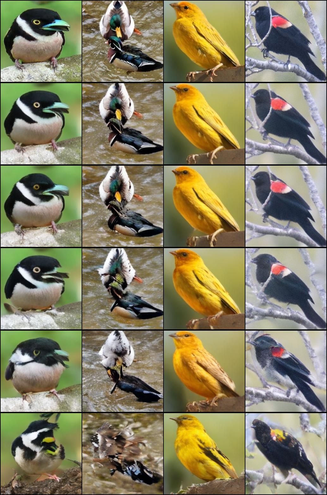

# Image synthesis
This repo contains VQGAN, GPT and MaskGIT training + inference code.
The code is developed from scratch, but also taken from several of the repositories.
([Taming transformers](https://github.com/CompVis/taming-transformers), [LlamaGen](https://github.com/FoundationVision/LlamaGen), [aa1234241/vqgan](https://github.com/aa1234241/vqgan))

## VQ-GAN results

## Image synthesis with Llama GPT (CFG=2.0)

## MaskGIT
- from top to bottom: original, reconstruction, 15 / 30 / 50 / 75 % masked tokens

